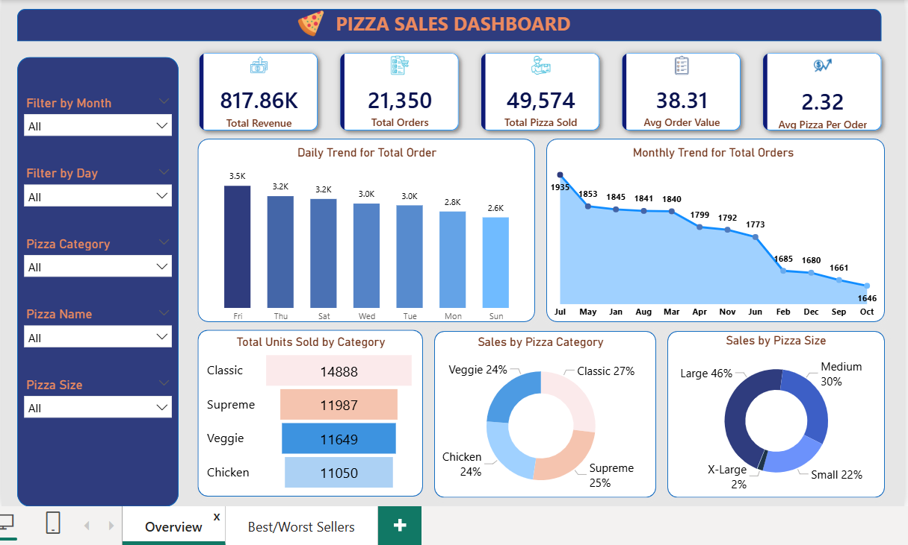
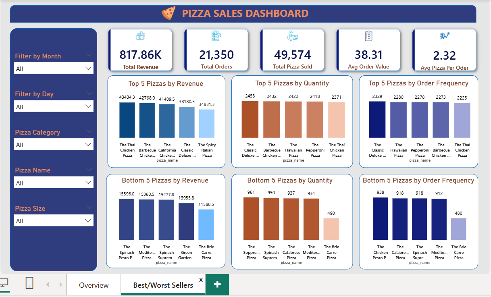

# 🍕 Pizza Sales Analysis Dashboard (Power BI & SQL)

## 📌 Project Overview
This project is a comprehensive sales analysis for a pizza store in 2015. It combines **SQL** to cross-verify Power BI chart results against raw data metrics, ensuring all visualizations are accurate and **Power BI** for interactive visualization. The goal is to track key performance indicators (KPIs), understand customer behavior, and optimize menu offerings based on sales performance.

*   **Dataset:** [Pizza Sales Dataset 2015 (Kaggle)](https://www.kaggle.com/datasets/nextmillionaire/pizza-sales-dataset)
*   **Total Records:** Over 48,000 transaction rows.

## 🛠️ Key Workflow
1.  **SQL Integration:** Developed multiple SQL queries to extract KPIs and verify data accuracy. These results were cross-checked with Power BI measures to ensure 100% data integrity.
2.  **Data Modeling:** Processed raw data using Power Query and established relationships within Power BI.
3.  **Visualization:** Designed a 2-page interactive dashboard focusing on **Sales Trends** and **Product Performance (Best/Worst Sellers)**.

---

## 📊 Dashboard Preview

### 1. Sales Performance Overview

### 2. Best & Worst Sellers Analysis

## 💡 Key Business Insights (Based on Dashboard)

### 1. Sales Trends & Peak Periods
*   **Busiest Days:** Orders peak significantly on **Fridays and Saturdays**. This confirms that pizza is a top choice for weekend meals and social gatherings.
*   **Monthly Peaks:** The highest order volumes occur in **January and July**. This suggests seasonal peaks or successful promotional campaigns during these months.
*   **Stable Demand:** Other weekdays show a very consistent order volume (around 3k orders), indicating a loyal base of daily customers.

### 2. Product Performance (Top & Bottom Performers)
*   **Revenue Leader:** **The Thai Chicken Pizza** contributes the **Maximum Revenue**, identifying it as the most profitable "Star" product.
*   **Popular Choice:** **The Classic Deluxe Pizza** ranks #1 in **Order Frequency** and **Quantity**, proving it is the most popular choice among the customer base.
*   **Least Popular:** **The Brie Carre Pizza** is at the bottom across all metrics (Revenue, Quantity, and Orders), which suggests a need for menu re-evaluation.

### 3. Category & Size Analysis
*   **Top Category:** The **Classic** category is the dominant performer, leading in total sales volume (~27%).
*   **Size Preference:** Customers strongly prefer **Large (46%)** and **Medium (30%)** pizzas, while X-Large and Small sizes have much lower demand.

## 🚀 Recommendations
1.  **Staffing:** Increase kitchen and delivery capacity during Friday/Saturday to maintain service speed.
2.  **Menu Engineering:** Consider replacing the **Brie Carre** with a new seasonal flavor or running a targeted promotion to clear inventory.
3.  **Upselling:** Since Large pizzas are the most popular, create "Family Meal Deals" centered around Large sizes to increase the Average Order Value (AOV).

---

